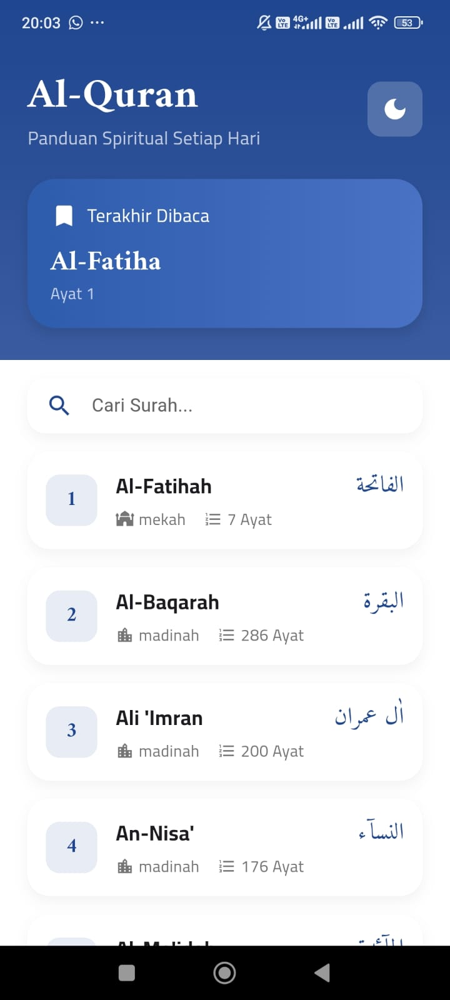

# Semangat Murojaah 📖

Aplikasi **Semangat Murojaah** adalah aplikasi Al-Quran berbasis Flutter yang dirancang untuk membantu pengguna membaca, memahami, dan menghafal Al-Quran dengan lebih baik.

## 🌟 Fitur Utama
- **Baca Al-Quran**: Tampilan Al-Quran lengkap dengan dukungan terjemahan dan tajwid.
- **Murojaah**: Pengingat dan pelacak hafalan untuk membantu para penghafal Al-Quran agar tetap istiqomah.
- **Bookmark Ayat**: Simpan ayat favorit kita.
- **Tema Gelap dan Terang**: Pilihan tema yang nyaman untuk mata.
- **Pencarian Ayat**: Fitur pencarian cepat untuk menemukan ayat tertentu.

## 🚀 Cara Instalasi
1. Pastikan kamu memiliki Flutter SDK versi terbaru. Jika belum, unduh dari [flutter.dev](https://flutter.dev).
2. Clone repositori ini:
    ```bash
    git clone https://github.com/username/semangat-murojaah.git
    ```
3. Masuk ke direktori proyek:
    ```bash
    cd semangat-murojaah
    ```
4. Jalankan perintah berikut untuk menginstal semua dependensi:
    ```bash
    flutter pub get
    ```
5. Jalankan aplikasi di emulator atau perangkat fisik:
    ```bash
    flutter run
    ```

## 📷 Cuplikan Layar
Berikut adalah tampilan aplikasi:




## 🛠️ Struktur Proyek
```
lib/
├── main.dart           # Entry point aplikasi
├── models/             # Model data
├── providers/          # State management
├── repositories/       # Logika pengambilan data
├── screens/            # Halaman aplikasi
├── services/           # Layanan seperti API
├── widgets/            # Komponen UI
```

## 🤝 Kontribusi
Kami menerima kontribusi dari siapa saja. Silakan buat pull request atau buka issue jika ada saran atau laporan bug.

## 📜 Lisensi
Aplikasi ini dilisensikan di bawah MIT License.
