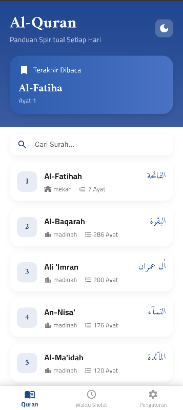
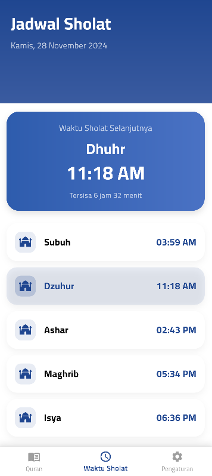

# Semangat Murojaah 📖🕌

## 📚 Tentang Proyek

**Semangat Murojaah** adalah aplikasi Al-Quran komprehensif berbasis Flutter yang dirancang untuk membantu umat Islam dalam perjalanan membaca, memahami, dan menghafal Al-Quran dengan lebih mudah dan menyenangkan.

## 🌟 Fitur Utama

### 🔍 Eksplorasi Al-Quran
- **Baca Al-Quran Lengkap**
  - Tampilan ayat dalam bahasa Arab
  - Terjemahan multi-bahasa
  - Panduan tajwid interaktif
  - Dukungan bacaan offline

- **Murojaah (Pengulangan Hafalan)**
  - Pengingat hafalan harian
  - Pelacakan progress hafalan
  - Statistik dan grafik capaian
  - Sistem penilaian (rating) hafalan

- **Fitur Tambahan**
  - Bookmark ayat favorit
  - Mode tema gelap/terang
  - Pencarian ayat cepat dan akurat
  - Dukungan multiple bahasa antarmuka

## 🔧 Teknologi yang Digunakan

### Framework & Bahasa
- 
- 

### State Management
- Provider
- GetX

### Dependensi Utama
- `quran_data`: Manajemen data Al-Quran
- `shared_preferences`: Penyimpanan lokal
- `http`: Komunikasi API
- `sqflite`: Database lokal

## 🚀 Cara Instalasi & Penggunaan

### Prasyarat
- Flutter SDK 3.10+
- Dart SDK
- Android Studio / VS Code
- Emulator/Perangkat Android/iOS

### Langkah Instalasi

1. **Clone Repositori**
    ```bash
    git clone https://github.com/username/semangat-murojaah.git
    cd semangat-murojaah
    ```

2. **Instal Dependensi**
    ```bash
    flutter pub get
    ```

3. **Jalankan Aplikasi**
    ```bash
    flutter run
    # Atau gunakan mode debug di IDE
    ```

## 📱 Tangkapan Layar

<p float="left">
  
  
  
  
  
</p>

## 🗂️ Struktur Proyek

```
semangat-murojaah/
│
├── lib/
│   ├── main.dart
│   ├── models/
│   │   ├── surah_model.dart
│   │   ├── ayat_model.dart
│   │   └── hafalan_model.dart
│   │
│   ├── providers/
│   │   ├── quran_provider.dart
│   │   └── hafalan_provider.dart
│   │
│   ├── repositories/
│   │   ├── quran_repository.dart
│   │   └── hafalan_repository.dart
│   │
│   ├── screens/
│   │   ├── home_screen.dart
│   │   ├── main_screen.dart
│   │   └── prayer_times_screen.dart
│   │   └── setting_screen.dart
│   │   └── surah_detail_screen.dart
│   ├── services/
│   │   ├── api_service.dart
│   │   └── prayer_service.dart
│   │
│   └── widgets/
│       ├── custom_app_bar.dart
│       └── hafalan_progress_card.dart
│
├── test/
└── assets/
```

## 🤝 Kontribusi

Kami sangat terbuka terhadap kontribusi dari komunitas. Silakan ikuti panduan berikut:

1. Fork repositori
2. Buat branch fitur baru (`git checkout -b fitur/AturHalamanBaru`)
3. Commit perubahan Anda (`git commit -m 'Tambah fitur baru'`)
4. Push ke branch (`git push origin fitur/AturHalamanBaru`)
5. Buka Pull Request

## 📋 Rencana Pengembangan

- [ ] Implementasi fitur tafsir
- [ ] Dukungan bahasa tambahan
- [ ] Integrasi kalkulator waktu sholat
- [ ] Mode hafalan interaktif
- [ ] Sinkronisasi data antar perangkat

## 🛡️ Lisensi

Didistribusikan di bawah **MIT License**. Lihat `LICENSE` untuk informasi lebih lanjut.
---

**Semangat Murojaah** - Menghafal Al-Quran Lebih Mudah, Lebih Dekat! 🕌📖